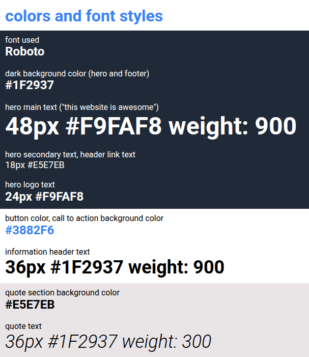

# Odin Landing Page

A landing page built as part of [The Odin Project Foundations curriculum](https://www.theodinproject.com/lessons/foundations-landing-page).

The goal of this project was to recreate a provided landing page design from scratch using HTML and CSS, with a focus on layout, Flexbox, spacing, typography, and working with real image assets.

## Live Demo

[View live site](https://lekrau.github.io/odin-landing-page/)

## Built with

- HTML
- CSS
- Flexbox

## What I practiced

- Structuring a complete landing page into multiple sections
- Recreating a design without aiming for pixel perfection
- Using Flexbox for page layout and alignment
- Working with image assets, including resizing and normalizing dimensions
- Writing cleaner CSS with custom properties and class-based section styling
- Committing changes incrementally with meaningful Git commit messages

## Assignment

This project is part of The Odin Project’s Foundations course. The assignment was to build a landing page based on two provided design images:

The project did not require responsive design. The focus was on building the page for a regular desktop screen and getting the major elements in roughly the correct position.

## Image Credits

- Banana: [freddy dendoktoor](https://www.publicdomainpictures.net/en/view-image.php?image=624600&picture=fruit-food-banana-cut-out-png), CC0 1.0
- Strawberry: [freddy dendoktoor](https://www.publicdomainpictures.net/en/view-image.php?image=624181&picture=fruit-food-strawberry-cut-out-png), CC0 1.0
- Apple: [Roboflow, Inc.](https://universe.roboflow.com/ai-and-machine-learning-8se6h/fruit-detection-model-mtegr), [CC BY 4.0](https://creativecommons.org/licenses/by/4.0/). Resized.
- Kiwi: [Keledjian Alexandre](https://commons.wikimedia.org/wiki/File:Macro_image_of_cross-section_of_a_kiwifruit.png), CC BY-SA 3.0. Resized.
- Croc: [freepng](https://commons.wikimedia.org/wiki/File:1-2-crocodile-free-png-image.png), CC BY-SA 4.0. Resized.